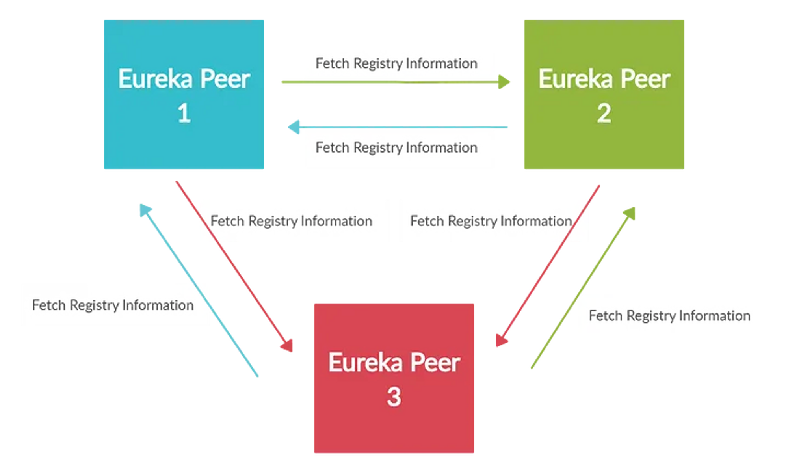

# Eureka cluster

## Reference
[joon2974 - HA of Service Discovery](https://joon2974.tistory.com/m/27)

[The practical developer - Service discovery with spring boot eureka](https://thepracticaldeveloper.com/spring-boot-service-discovery-eureka/)



## Config yaml

```
spring:
  config:
    activate:
      on-profile: "peer-1"
  application:
    name: eureka-server-clustered
server:
  port: 9001
eureka:
  instance:
    hostname: peer-1-server.com
  client:
    # 서버가 실행되었을 때 자동으로 Eureka 서버에 등록 (꼭 클라이언트 뿐만 아니라 서버도 이 설정을 통해 상호간 등록이 가능하다.)
    registerWithEureka: true
    # Eureka 서버로부터 서비스 리스트 정보를 자신의 local에 캐싱(default 30초)
    fetchRegistry: true
    # 자동 등록될 Eureka 서버 정보
    serviceUrl:
      defaultZone: http://peer-2-server.com:9002/eureka/,http://peer-3-server.com:9003/eureka/

---
spring:
  config:
    activate:
      on-profile: "peer-2"
  application:
    name: eureka-server-clustered
server:
  port: 9002
eureka:
  instance:
    hostname: peer-2-server.com
  client:
    registerWithEureka: true
    fetchRegistry: true
    serviceUrl:
      defaultZone: http://peer-1-server.com:9001/eureka/,http://peer-3-server.com:9003/eureka/

---
spring:
  config:
    activate:
      on-profile: "peer-3"
  application:
    name: eureka-server-clustered
server:
  port: 9003
eureka:
  instance:
    hostname: peer-3-server.com
  client:
    registerWithEureka: true
    fetchRegistry: true
    serviceUrl:
      defaultZone: http://peer-1-server.com:9001/eureka/,http://peer-2-server.com:9002/eureka/
```

## Troubleshooting

### Unavailable replicas

유레카 서버가 다르게 인식되기 위해서 호스트명이 달라야 한다

> If you’re getting your Eureka instance as an ‘unavailable replica’, it might be due to one of these reasons:
> 
> - You didn't use the same application name in both instances (pay attention to the EUREKA-CLUSTER in the screenshot, what do you see?).  
> - You missed the context /eureka in your defaultZone URLs.  
> - Did you use the same hostname for both instances (e.g. localhost)? Remember that they must be different.  
> - The hostnames can't be mapped by your computer (did you include them in your hosts file?).  

hosts 등록 처리
```
127.0.0.1 peer-1-server.com
127.0.0.1 peer-2-server.com
127.0.0.1 peer-3-server.com
```